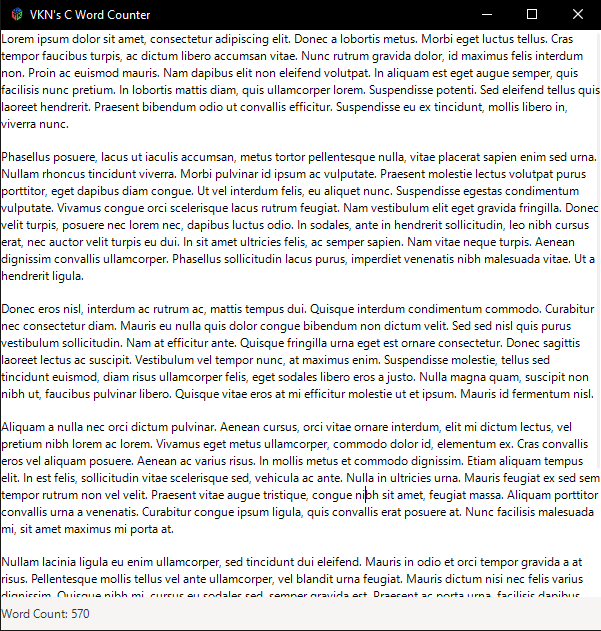

# C Word Counter

A lightweight desktop word counter built from scratch in C using GTK 3.



## Features

- Multi-line text input with word wrapping
- Live word count that updates as you type
- Scrollable text area

## Building

Requires [MSYS2](https://www.msys2.org/) with the MinGW64 toolchain and GTK 3.

```bash
# Install dependencies (MINGW64 terminal)
pacman -S mingw-w64-x86_64-gcc mingw-w64-x86_64-gtk3 pkgconf

# Build
make
```

## Running

```bash
./wordcounter.exe
```

## Built With

- C
- GTK 3
- MSYS2 / MinGW-w64